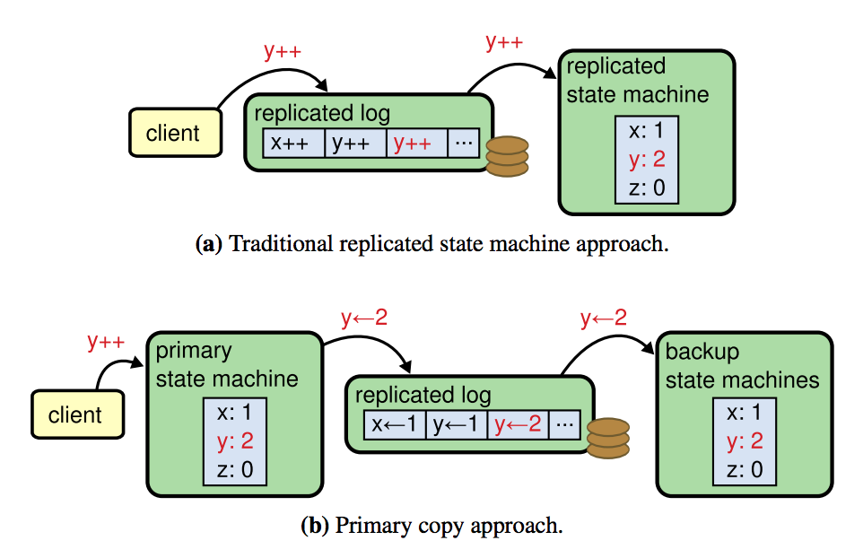

## ZooKeeper Codewalk

ZooKeeper – _сервис координации_, который помогает строить другие распределенные системы. ZK предоставляет простую и очень выразительную модель данных и API, через которые можно выразить _рецепты_ для управления конфигурациями, выбора лидера, обнаружения сбойных узлов и т.п.

- [ZooKeeper: Because Coordinating Distributed Systems is a Zoo](https://zookeeper.apache.org/doc/current/index.html)
- [ZooKeeper: Wait-free coordination for Internet-scale systems](https://www.usenix.org/legacy/event/atc10/tech/full_papers/Hunt.pdf)

Наша задача – изучить реализацию этой системы.

ZK представляет собой детерминированный автомат, который поддерживается в согласованном состоянии на ансамбле реплик с помощью механизма репликации лога. В отличие от Multi-Paxos или RAFT, ZK реплицирует не команды клиента, а дельты состояния, которые в ZK называются _транзакциями_ (_transactions_).

------

[Исходный код сервера ZK](https://github.com/apache/zookeeper/tree/master/zookeeper-server/src/main/java/org/apache/zookeeper/server)

См. также главу _ZooKeeper Internals_ из [ZooKeeper: Distributed Process Coordination](https://yadi.sk/i/PNKNOlsU49sfyQ). 

### Реплицируемый Автомат

- Найдите код автомата, который реплицирует ZooKeeper
- Какие атрибуты есть у узлов дерева? Как они используются?
- Есть ли в дереве служебные узлы?

### Выборы лидера

- Найдите интерфейс компонента, который отвечает за выбор лидера
- Найдите реализацию алгоритма выбора лидера. Как устроен этот алгоритм?
- Какие роли / состояния есть в алгоритме, помимо лидера?

### Конвейер обработки запроса

- Из каких `RequestProcessor`-ов состоит конвейер обработки запросов на реплике-лидере? За что отвечает каждый компонент в этом конвейере?
- Найдите код, который диспетчеризует обработку пользовательских операций
- Найдите код, который строит имя sequential-узла при его создании
- Найдите код, который строит транзакцию для операции `setData`
- Найдите код, который применяет построенную транзакцию к дереву
- Как обслуживаются read-only запросы? Найдите код, который формирует ответ на запрос `getData`
- Найдите код, который отправляет ответ клиенту
- Что делает команда `sync`? Найди код обработки команды `sync`.

### Лог транзакций

- Найдите код, который выполняет сегментирование лога транзакций и преаллокацию сегментов
- Как выполняется сброс данных лога на диск?
- Найдите код, который выполняет оптимизацию group commits, т.е. батчит записи в лог транзакций

### Снимки состояния

- Какие данные составляют снимок состояния? 
- Найдите код, который пишет снимок дерева. Как он синхронизирован с конкурирующими апдейтами?
- Где и при каком условии запускается создание снапшота?
